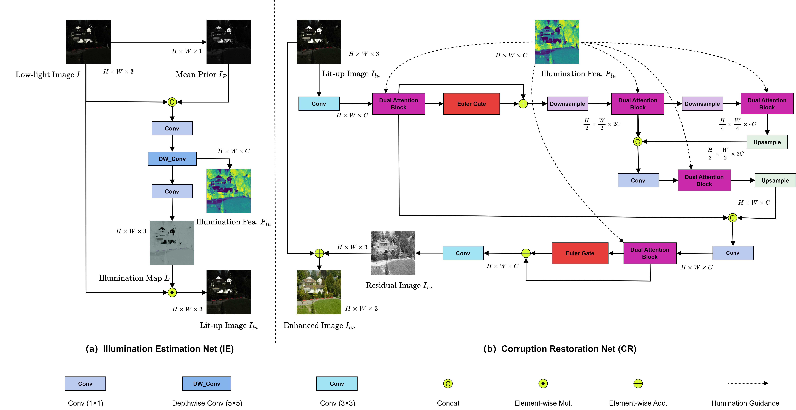

# Progressive Illumination-aware Transformer for Retinex-based Low-Light Image

This repository contains the official implementation of the manuscript **Progressive Illumination-aware Transformer for Retinex-based Low-Light Image Enhancement**. It provides the final RPIFormer model, training and testing configurations, and the evaluation script used in our experiments.



## Environment Setup

Recommended environment:

- Python `3.10`
- PyTorch `2.5.1+cu121`
- TorchVision `0.20.1+cu121`
- CUDA `12.1`

```bash
# create a new conda environment
conda create -n rpiformer python=3.10 -y
conda activate rpiformer

# install python dependencies
pip install --upgrade pip
pip install -r requirements.txt
```

## Datasets

Create a `data/` directory in the repository root, then download the datasets from [Baidu Netdisk](https://pan.baidu.com/s/1Lmv9VQ-7Wu3LwXrqzL6v4Q?pwd=gi1s).

- Extraction code: `gi1s`
- Dataset paths should match the paths defined in `options/train/*.yml` and `options/test/*.yml`

## Pretrained Models

Create a `pretrained_weights/` directory in the repository root, then download the checkpoints from [Baidu Netdisk](https://pan.baidu.com/s/1phFUj8jvFC_MoEgamBayGA?pwd=pwd1).

- Extraction code: `pwd1`

## Testing

```bash
python tools/test_dataset.py --opt options/test/rpiformer_lolv1.yml --weights pretrained_weights/rpiformer/best_LOL_v1_model.pth --dataset LOL_v1 --gpus 0
python tools/test_dataset.py --opt options/test/rpiformer_lolv2_real.yml --weights pretrained_weights/rpiformer/best_LOL_v2_real_model.pth --dataset LOL_v2_real --gpus 0
python tools/test_dataset.py --opt options/test/rpiformer_lolv2_synthetic.yml --weights pretrained_weights/rpiformer/best_LOL_v2_synthetic_model.pth --dataset LOL_v2_synthetic --gpus 0
python tools/test_dataset.py --opt options/test/rpiformer_sid.yml --weights pretrained_weights/rpiformer/best_SID_model.pth --dataset SID --gpus 0
```

## Training

```bash
python tools/train.py --opt options/train/rpiformer_lolv1.yml
python tools/train.py --opt options/train/rpiformer_lolv2_real.yml
python tools/train.py --opt options/train/rpiformer_lolv2_synthetic.yml
python tools/train.py --opt options/train/rpiformer_sid.yml
```

For `LOLv2-real`, `LOLv2-synthetic`, and `SID`, the provided training configs use Euler-stage checkpoints as warm-start initialization.

## Acknowledgements

This codebase is built on BasicSR and RetinexFormer.
